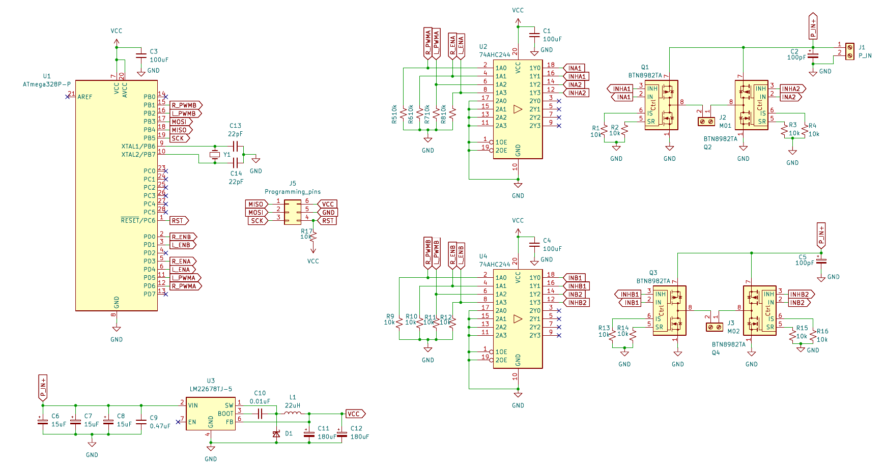

## I00-Motor-Module

### Schematic

### to-do
- [ ] fix decoulping caps values
- [ ] fix SR/IR resistors values
- [ ] add reverse polarity protection
- [ ] use stand ISP pin order
- [ ] 

### Datasheets
- https://www.ti.com/lit/ds/symlink/lm2678.pdf
- https://web.mit.edu/6.111/volume2/www/f2018/handouts/ATmega328P.pdf
- 
